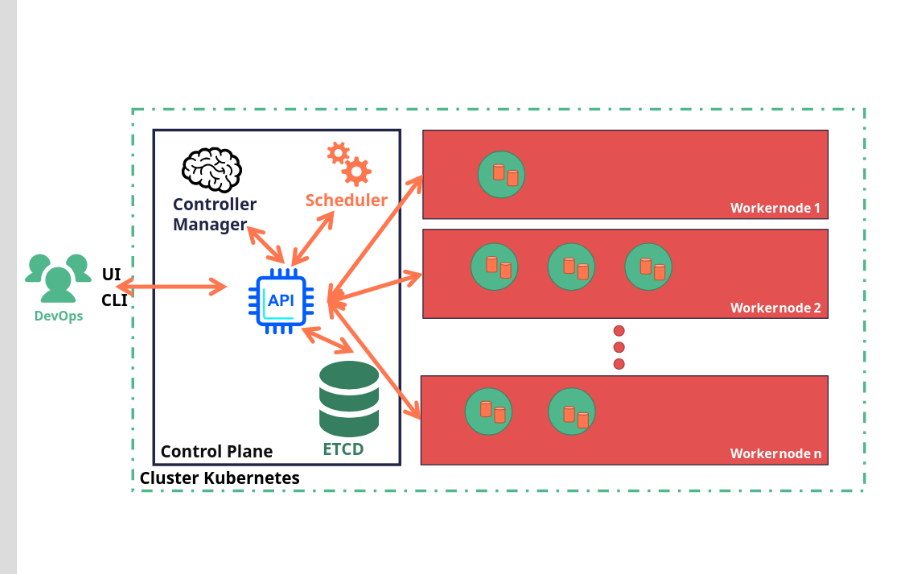

### ressources:
https://blog.stephane-robert.info/docs/conteneurs/orchestrateurs/kubernetes/architecture/

---

### images:
**part 1 clusters control plane**

---
**part 3 clusters control plane**
le provisioning installe docker k3d et kubectl, puis crée le cluster fbessons.
un kubeconfig est généré pour l’utilisateur vagrant.

argocd est installé dans le namespace argocd, puis configuré via deux manifests.
une application argocd surveille mon dépôt github et déploie automatiquement une application playground dans le namespace dev.

grâce à la politique gitops (automated, prune, selfheal), toute modification dans le repo déclenche un redéploiement automatique du pod.
l’application est exposée via un service loadbalancer sur le port 8080 de la machine hôte

### project:
1. Kubernetes clusters configuration with k3s et k3d
2. Multiple web app deployment
3. Pipeline infrastructure CI/CD
